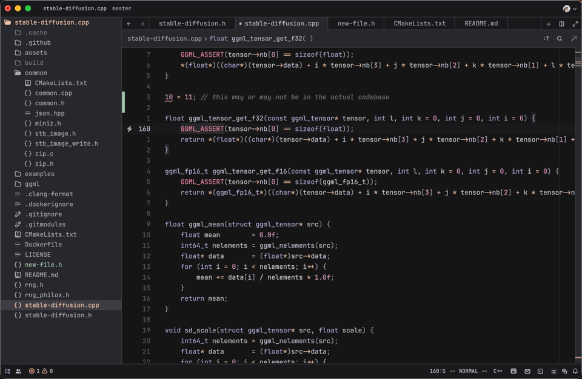

<h1 align="center">Mellow for Zed 🎨</h1>

  
  

 

You're never going to believe this, but Mellow for Zed is... <b>the Zed port of the <a href="https://github.com/mellow-theme/mellow.nvim/tree/main">Mellow</a> theme</b>!

 

  

